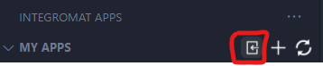
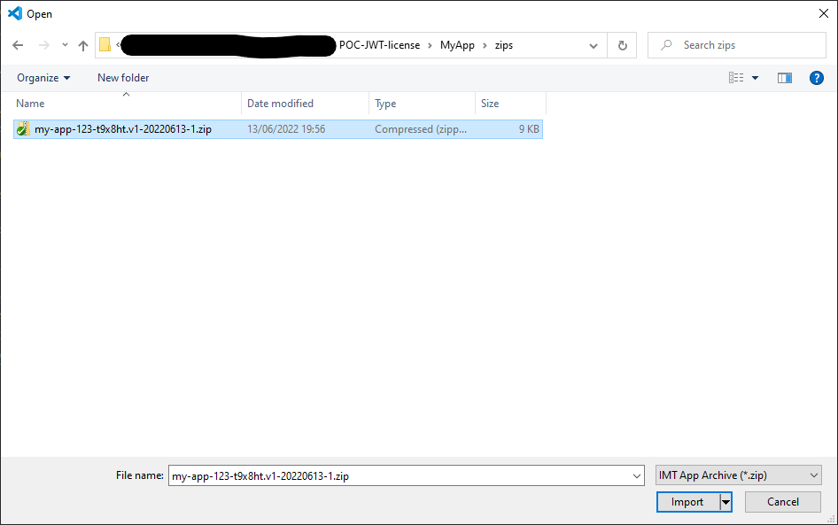
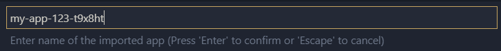
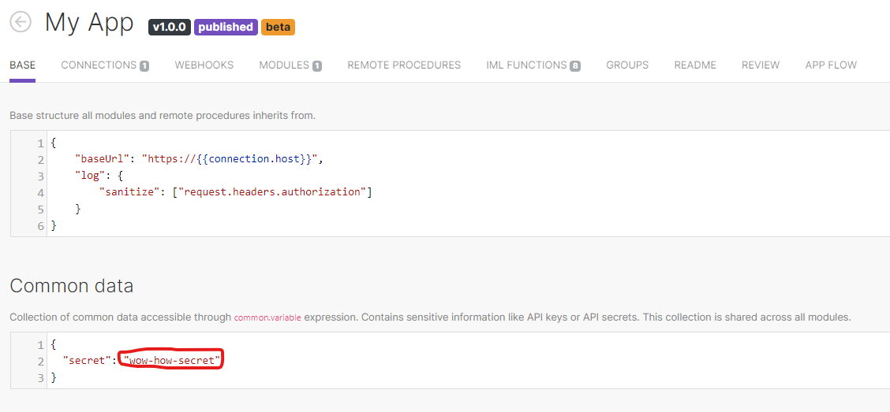
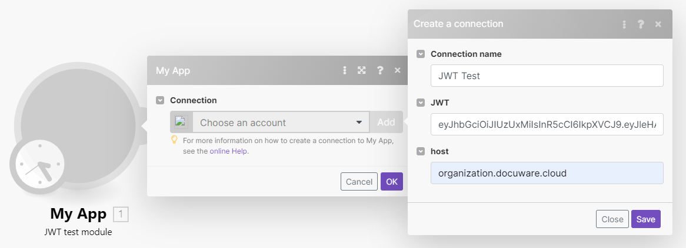
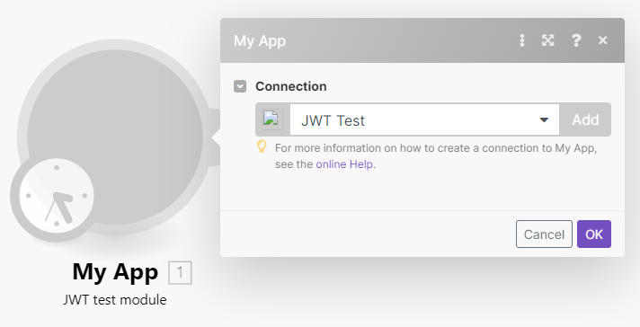
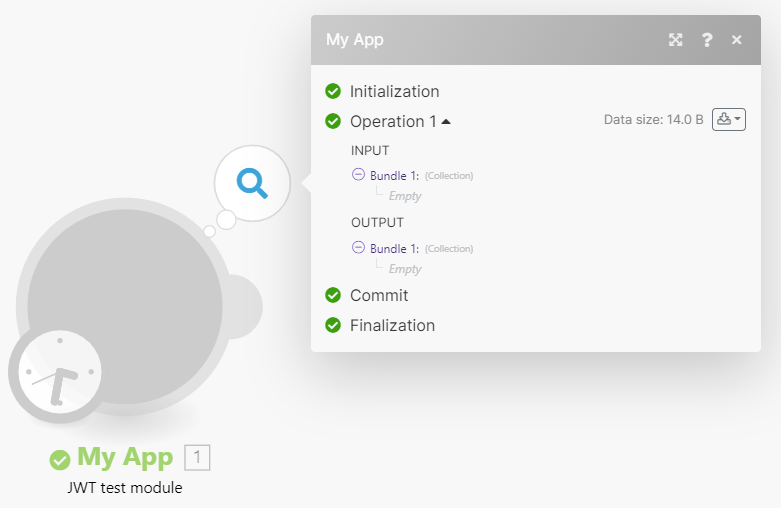
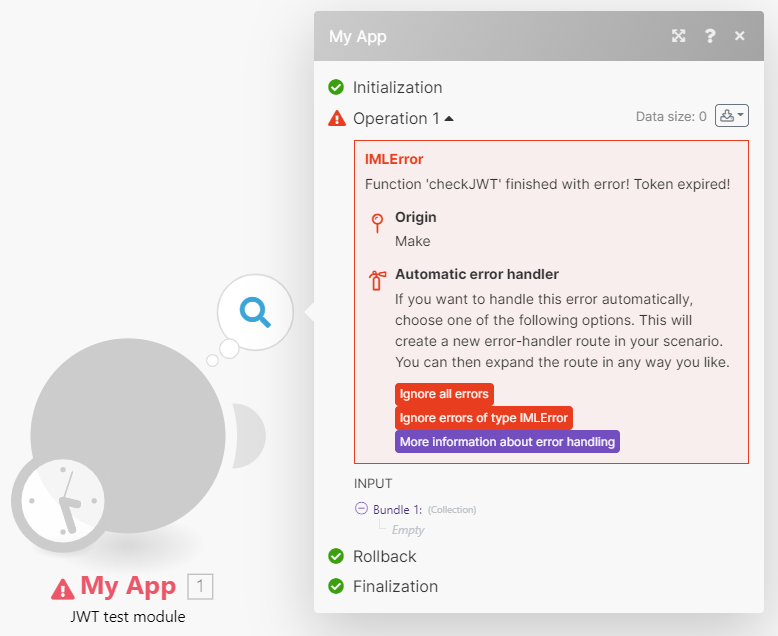

# How to use this POC
This is a Proof of Concept(POC) for how to do licensing with a JWT in the Make iPaaS environment.
## What is in the folders
__Generator__: There you will find example code to generate an JWT see for more details [Generator](#generator)\
__Make__: There are all parts which are used in Make to verify the JWT see for more details [Make](#make)\
__Make/MyApp__: Is a example App export from Make for more details [MyApp](#makemyapp)
### Generator
Adapt the three constants `lifetime`, `host` and `secret` to your needs.\
The constant `lifetime` is what you can already guess by the name the lifetime of the JWT.\
`Host` is the part of the url which should be contained in the url later on for the verification.\
The `secret` contains the string which is used to encrypt the JWT.
### Make
Contains a simple representation of the Make IML Functions to make it possible to test the JWT without a Make Connector.\
Only edit the two constants `jwtValue`, `secret` and `host`.\
The `jwtValue` is the JWT which was generated and should be verified.\
`Secret` contains the string which is used for the verify encryption to check the validity of the JWT.\
The `host` constant represent a url where the host from the generation is contained or not.\
When there isn't the host contained the JWT is invalid.\
All functions in this file are the same like in the make [MyApp](#makemyapp) example.
### Make/MyApp
Configure first the Make app SDK further information how to under [https://docs.integromat.com/apps/apps-sdk](https://docs.integromat.com/apps/apps-sdk)\
Request for your developer account the IML Functions [https://docs.integromat.com/apps/app-structure/iml-functions](https://docs.integromat.com/apps/app-structure/iml-functions) because these are disabled by default and\
without it isn't possible to use the example.\
#### Import app
After that import the backup with the Import App in Visual Studio Code.
1. Klick on the import app button.\

2. Select the backup zip file.\

3. Give them a better name.\

#### Use JWT verify
1. Change common secret.\
\
2. Create scenario with the test module.\
3. Add connection.\
\
\
3.1. Run the module with success.\
\
3.2. Run Module with error.\
